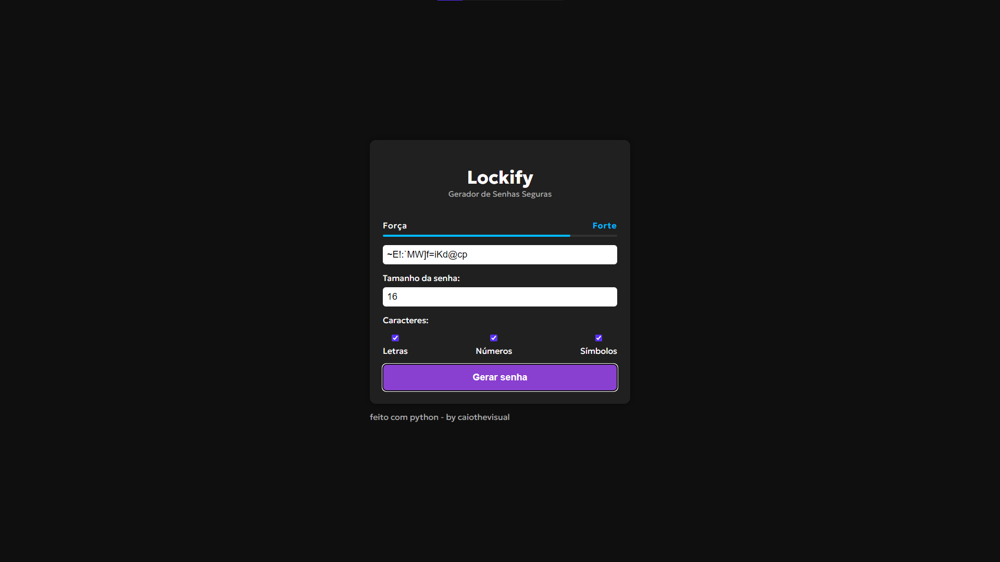

# LOCKIFY

Um gerador de senhas seguras desenvolvido com FastAPI (Python) no backend e HTML, CSS e JavaScript no front-end.<br/>
Este projeto é livre para estudo e aprendizado, ele permite personalizar o tamanho da senha e escolher se ela deve conter letras, números e símbolos.

## Capturas de Telas



## Funcionalidades

- Gerar senhas aleatórias e seguras
- Definir o tamanho da senha (4 a 64 caracteres)
- Escolher tipos de caracteres: Letras, Números e Símbolos
- API simples e rápida usando FastAPI
- Interface web minimalista

## Como Executar o Projeto

### Clonar o repositório
```bash
git clone https://github.com/caiovisuals/lockify
cd lockify
```

### Instalar as dependências
```bash
pip install fastapi uvicorn
```

### Rodar o servidor FastAPI
```bash
uvicorn backend.main:app --reload

O backend estará disponível em:
http://localhost:8000
```

by caiothevisual  
#caiobavisuals #lockify #python #password